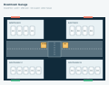

# Parking Garage Management API

<p align="center">
  <strong>One clear source of truth for a garage layout, live occupancy, vehicle sessions, and operational history.</strong>
</p>

<p align="center">
  <a href="https://pzarzycki.github.io/b-parking-api/"></a>
  <a href="https://github.com/pzarzycki/b-parking-api/actions/workflows/docs-pages.yml"></a>
  
  
  
</p>

<p align="center">
  <a href="https://pzarzycki.github.io/b-parking-api/"><strong>Read the live documentation →</strong></a>
  ·
  <a href="https://pzarzycki.github.io/b-parking-api/api-reference/"><strong>Browse the API reference →</strong></a>
</p>



Parking Garage Management API is a contract-first system for operating a single parking garage. It stores a versioned floor-plan document, exposes live spot availability, records vehicle check-ins and check-outs, manages staff access, and preserves an audit trail.

## What’s included

| Area | Capability |
| --- | --- |
| Operations API | JWT-authenticated check-in/out, spot occupancy, users, parking history, and audit events. |
| Floor plans | Schema-validated YAML layouts with routes, gates, amenities, bays, and accessible/EV spaces. |
| Dashboard | A React operations UI with live floor maps and spot-level workflow. |
| Documentation | Docusaurus guides, Mermaid database schema, generated floor-plan visuals, and a static Scalar API reference. |

## Quick start

**Prerequisites:** Docker Compose, Node.js 22+, and npm.

```bash
npm ci
npm ci --prefix web
docker compose up --build
```

Once the services are healthy:

| Service | URL |
| --- | --- |
| Operations dashboard | [http://localhost:8080](http://localhost:8080) |
| API | [http://localhost:3000](http://localhost:3000) |
| Swagger UI | [http://localhost:3000/api/docs](http://localhost:3000/api/docs) |
| OpenAPI contract | [http://localhost:3000/openapi.yaml](http://localhost:3000/openapi.yaml) |

On a fresh local database, Compose creates `admin` / `admin` and loads the sample two-floor layout. Change this bootstrap password immediately. Existing local data remains in the named PostgreSQL volume.

## Documentation

The public documentation is deployed to [pzarzycki.github.io/b-parking-api](https://pzarzycki.github.io/b-parking-api/) through GitHub Actions. It is entirely static and does not require Docker.

```bash
npm ci
npm ci --prefix docs/website
npm run docs:check      # validate the contract, YAML example, generated images, and static build
npm run docs:start      # author locally
npm run docs:preview    # serve the production build locally
```

The documentation build copies the canonical OpenAPI contract and the complete example layout, then regenerates the floor-plan SVGs from `scripts/render-floor-plan.ts`.

## Useful commands

```bash
npm run build                  # type-check API and scripts
npm test                       # unit tests
npm run test:integration       # opt-in disposable Compose integration tests
npm run web:dev                # start the Vite dashboard
npm run web:build              # build the dashboard
npm run floor-plan:validate    # validate examples/garage-layout.yml and renderer constraints
npm run floor-plan:render -- examples/garage-layout.yml --floor ground --output ground.svg
```

## Project references

- [Live documentation](https://pzarzycki.github.io/b-parking-api/)
- [Static API reference](https://pzarzycki.github.io/b-parking-api/api-reference/)
- [Canonical OpenAPI contract](specs/openapi.yaml)
- [System design](specs/system-design.md)
- [Example floor-plan YAML](examples/garage-layout.yml)
