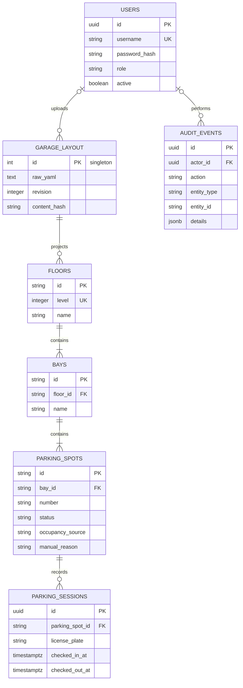

# Database schema

The service stores the uploaded layout as one canonical document and maintains relational projections for efficient operational queries. Parking sessions and audit events preserve history independently from the current spot state.

## Layout and live state

`garage_layout` is a singleton record containing the original uploaded YAML, a revision, a SHA-256 content hash, update time, and uploader. Its projected `floors`, `bays`, and `parking_spots` records make availability queries and lifecycle checks efficient.

`parking_spots.status` is the current operational state. When a spot is manually occupied, `occupancy_source` is `manual` and a reason is required. Vehicle occupancy is associated with an active parking session and cannot be released through the manual status endpoint.

## History and accountability

`parking_sessions` retain check-in details even after checkout. Database constraints permit at most one active session for a plate and for a spot, protecting against concurrent double assignment.

`audit_events` are append-only records of authenticated changes. Their actor is nullable only for system bootstrap, and their entity fields allow a single audit stream to refer to layouts, users, spots, sessions, and other domain records.
